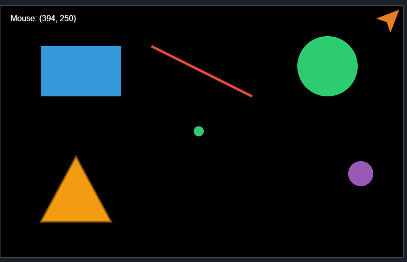
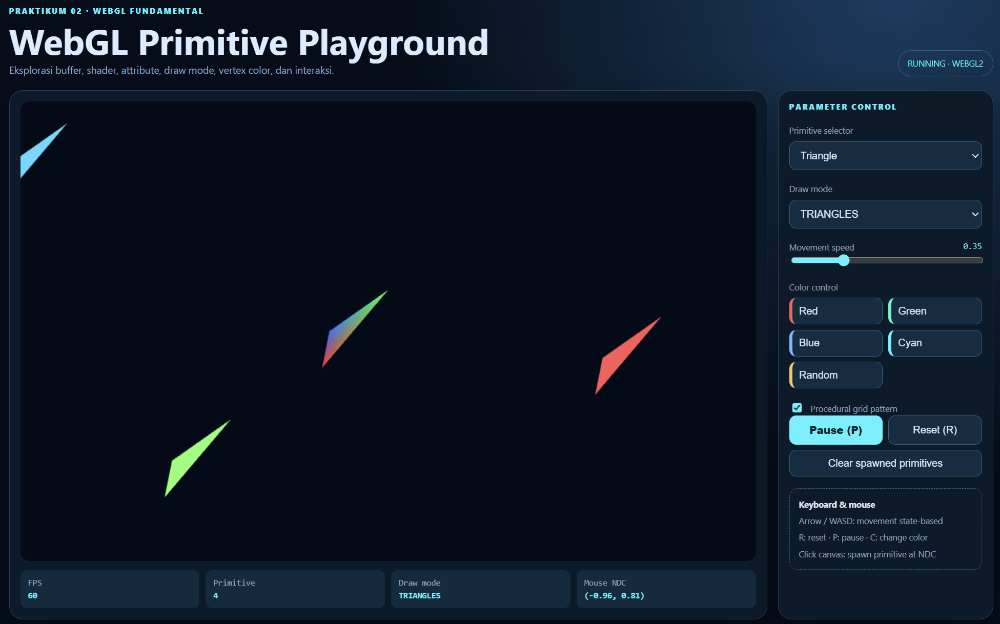
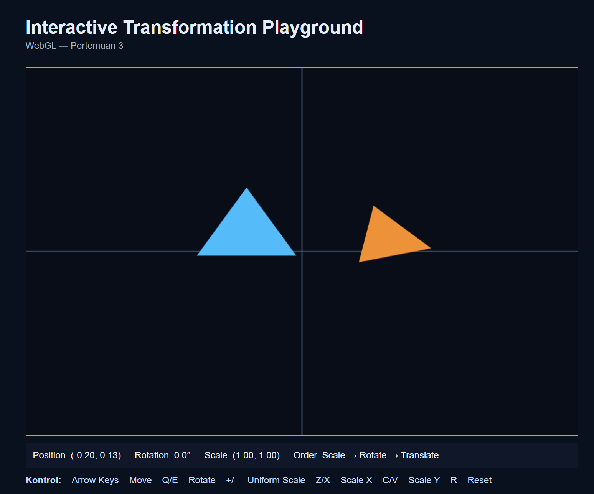

# Praktikum Grafika Komputer

[Praktikum 1 - Graphics Playground dengan HTML Canvas 2D](https://grescea.github.io/praktikum-grafika-p1)

[Praktikum 2 - WebGL Fundamental Playground](https://grescea.github.io/praktikum-webgl-02)

[Praktikum 3 - Interactive Transformation & Coordinate System dengan WebGL](https://grescea.github.io/praktikum-transform-03)

